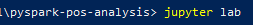

# pyspark-pos-analysis (Taller 1)

## Members:
- León Vargas Boris Nicolas
- Losada Ordoñez Mateo Alejandro

## Youtube Video:
- https://youtu.be/bw_i9_Z24XA

## High-level functionality

- This code uses an algorithm with PySpark implementing MapReduce to count the different elements of the Part Of Speech (POS) found in the proposed article, this with the purpose of knowing how much adjectives, verbs, etc are in the file.

- We made a fork of the repo to start the process and made some changes to the "default" code, implementing functions seen in the last sessions. 

- The screenshots of the different activities made in the "part 1" are shown in the directory "evidences" with the most important parts of the installation process, as the environment variables configuration.

- On the other hand, all the evidences of the "part 2" can be seen inside the projects, so please run the project with the following steps:

#### Instructions

+ Clone this repository
+ Open a command line console and go inside the repo's directory and run the command "jupyter lab"

+ There are the graphics and the results of the program.
